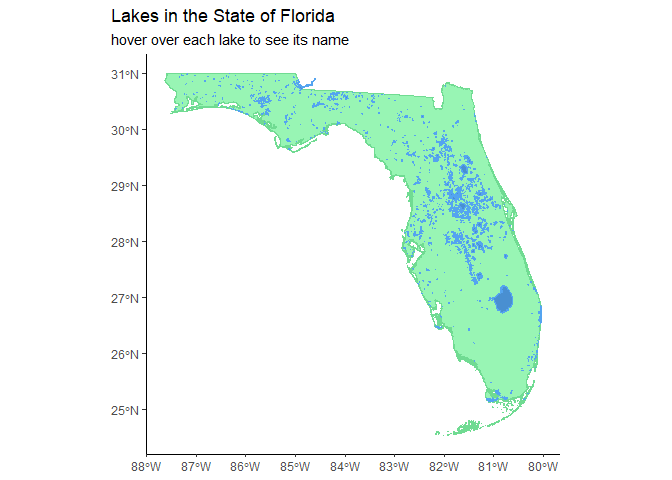
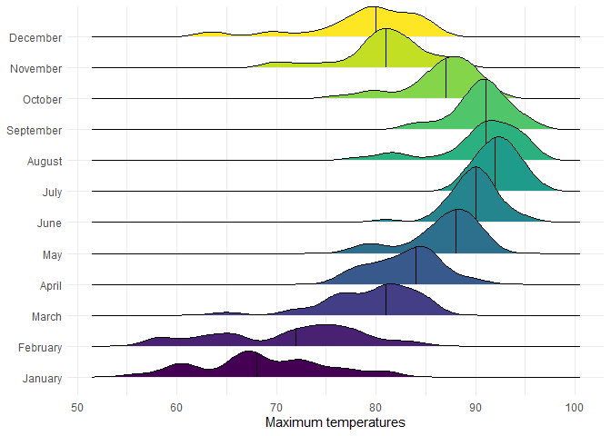

# Data Visualization and Reproducible Research

> Robert Thompson 

Learn more about me in my [GitHub profile page](https://github.com/RCThompson2600)

The following is a sample of products created during the _"Data Visualization and Reproducible Research"_ course.

## Project 01

In the `project_01/` folder you can find an analysis of used car listing data sourced from https://www.kaggle.com/datasets/rupeshraundal/marketcheck-automotive-data-us-canada?resource=download&select=us-dealers-used.csv 
In my analysis I focused on only the 20 most common makes listed in the state of florida, as otherwise this data set would have been too large to resonably handle.  

**Sample data visualization:** 

This sample visualization shows the number of listings in the state of florida for the 20 most common makes.  

## Project 02

In this project, I explored the West Roxubury housing data set, as well as the Florida Lakes shapefiles dataset to create my visualizations.  Using the West Roxbury dataset I compared factors that contribute to the total cost of houses.  Using the Florida Lakes data set I created an interactive map of the lakes in Florida, as well as comparing the perimeter of lakes to their area, to create a model that can be used to estimate the area of a lake based on its perimeter.   Find the code and report in the `project_02/` folder.

**Sample data visualization:** 

This is a sample of the interactive map that allows the uset to explore the lakes in the state of florida.  

## Project 03

In this project, I explored Tampa weather data, as well as experimented with text based data visualizations using lyrics from the top 100 Billboard charts in 2015.  

**Sample data visualization:** 

### Moving Forward

The process of exploring, summarizing and creating data visualizations is something that I have found very enjoyable over the course of these projects.  I found that I most enjoyed creating interactive plots, and the map I created using shapefiles.  I plan on continuing to use these skills for personal enjoyment, and I plan on further exploring cartography with data visualization.  
