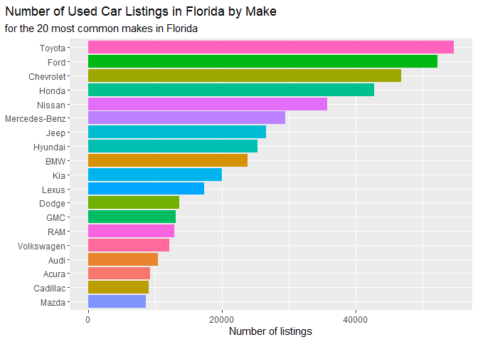
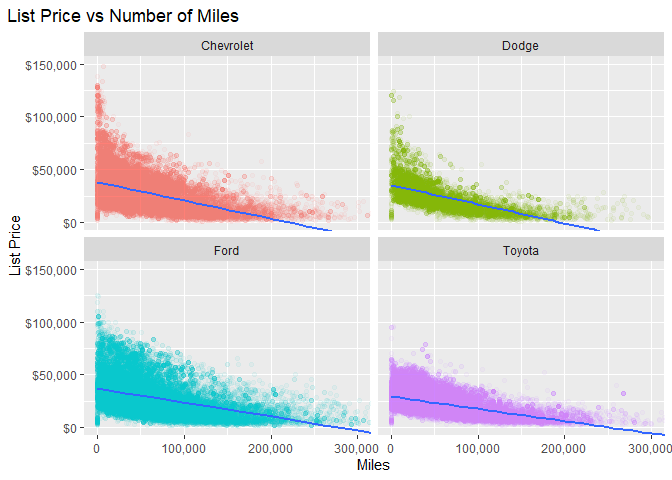
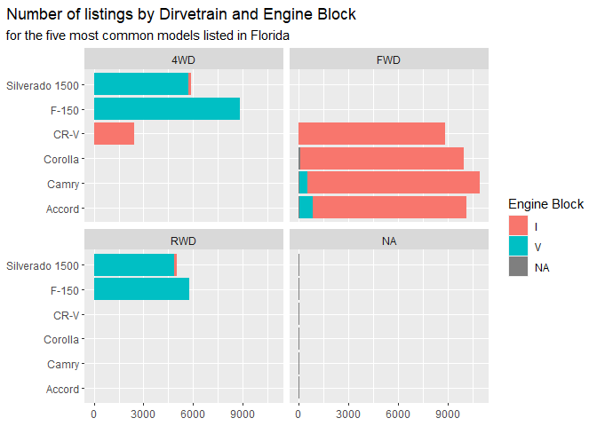

# Data Visualization Project 01

_revised version of mini-project 01 goes here_


For this version, I have pre-filtered my data in order to save both storage space and processing time, I am skipping most of the summarizing steps, and jumping straight to the filtered data that I used for my visualizations.  

```r
library(tidyverse)
```

```
## ── Attaching packages ─────────────────────────────────────── tidyverse 1.3.1 ──
```

```
## ✔ ggplot2 3.3.6     ✔ purrr   0.3.4
## ✔ tibble  3.1.7     ✔ dplyr   1.0.9
## ✔ tidyr   1.2.0     ✔ stringr 1.4.0
## ✔ readr   2.1.2     ✔ forcats 0.5.1
```

```
## ── Conflicts ────────────────────────────────────────── tidyverse_conflicts() ──
## ✖ dplyr::filter() masks stats::filter()
## ✖ dplyr::lag()    masks stats::lag()
```

```r
florida_top_20 <- read_csv("data/florida_top_20.csv")
```

```
## Rows: 464208 Columns: 21
```

```
## ── Column specification ────────────────────────────────────────────────────────
## Delimiter: ","
## chr (16): id, vin, stock_no, make, model, trim, body_type, vehicle_type, dri...
## dbl  (5): price, miles, year, engine_size, zip
## 
## ℹ Use `spec()` to retrieve the full column specification for this data.
## ℹ Specify the column types or set `show_col_types = FALSE` to quiet this message.
```

Summarising data by most common models

```r
florida_top_20_ordered <- florida_top_20 %>%
  group_by(make) %>%
  summarise(num = n())
florida_top_20_ordered
```

```
## # A tibble: 19 × 2
##    make            num
##    <chr>         <int>
##  1 Acura          9303
##  2 Audi          10432
##  3 BMW           23857
##  4 Cadillac       9084
##  5 Chevrolet     46867
##  6 Dodge         13611
##  7 Ford          52230
##  8 GMC           13054
##  9 Honda         42839
## 10 Hyundai       25321
## 11 Jeep          26594
## 12 Kia           19971
## 13 Lexus         17374
## 14 Mazda          8601
## 15 Mercedes-Benz 29531
## 16 Nissan        35794
## 17 RAM           12892
## 18 Toyota        54763
## 19 Volkswagen    12090
```
# Visualizing

Creating a plot to visualize number of listing for the 20 most popular makes in Florida

```r
p <- ggplot(florida_top_20_ordered, aes(x = reorder(make, +num), 
                                   fill = make,
                                   y = num))
p + geom_col() +
  coord_flip() + 
  theme(legend.position = "none", 
        plot.title.position = "plot") + 
  labs(title = "Number of Used Car Listings in Florida by Make",
       subtitle = "for the 20 most common makes in Florida") + 
  xlab(NULL) + 
  ylab("Number of listings")
```

<!-- -->

Plotting miles against price to see how miles affect list price.  

```r
p <- ggplot(filter(florida_top_20, make %in% c("Chevrolet", "Ford", "Dodge", "Toyota")), 
                   aes(x = miles, 
                       y = price))
p + geom_point(alpha = 0.05, mapping = aes(color = make)) +
  geom_smooth(method = "lm") + 
  theme(legend.position = "none", 
        plot.title.position = "plot") + 
  labs(title = "List Price vs Number of Miles") + 
  scale_y_continuous(labels = scales::dollar) +
  scale_x_continuous(labels = scales::label_comma()) +
  xlab("Miles") + 
  ylab("List Price") +
  facet_wrap("make") + 
  coord_cartesian(ylim = c(0, 150000), xlim = c(0, 300000))
```

```
## `geom_smooth()` using formula 'y ~ x'
```

```
## Warning: Removed 16224 rows containing non-finite values (stat_smooth).
```

```
## Warning: Removed 16224 rows containing missing values (geom_point).
```

<!-- -->
Examining various aspects of the 6 most common models.  

```r
p <- ggplot(filter(florida_top_20, model %in% c("F-150", "CR-V", "Camry", "Silverado 1500", "Accord", "Corolla")), 
                   aes(x = model,
                       fill = engine_block))
p + geom_bar() + 
  theme(plot.title.position = "plot") + 
  labs(title = "Number of listings by Dirvetrain and Engine Block", 
       subtitle = "for the five most common models listed in Florida",
       fill = "Engine Block") + 
  xlab(NULL) + 
  ylab(NULL) +
  facet_wrap("drivetrain") +
  coord_flip()
```

<!-- -->
 
# Analyzing

In my initial plans for this assignment I knew I wanted to compare how number of miles affect the list price of used cars, I also considered the same for model year instead of miles, but in the end I decided that including both would be kind of redundant.  I chose to stick with miles instead of model year since miles are a continuous variable that would be better suited to a scatterplot.  I also knew I wanted a plot that would summarize the majority of the data, my initial thought was to do this with a scatterplot, but because the dataset I chose was so large, a scatterplot would have too many points to be easily readable, so I settled for a histogram comparing the number of listings for the top 20 most common makes.  I had to do a lot of data filtering in order to make things readable, as well as to save processing time because the dataset I chose was so large.  I came up with the idea for my final plot as I was exploring the data, I wanted to compare some of the more technical specifications like engine block and drivetrain, so I compared this for the 5 most common models in the dataset.  

My plots would allow me to tell a fairly complete story about the most common used car listings in the state of Florida.  I would be able to explain what the most common makes are, and how the amounts of listings for each of these compare to each other.  With my second plot I would be able to extrapolate the rate at with a cars value decreases as its miles increase. With my final plot I could not only observe some of the technical factors and how they compare among the most common models, but also some interesting relationships, such as how most of the models have inline engine blocks, however, the only two pickup trucks, the F-150 and the Silverado, are overwhemingly V engine blocks.  

My focus for my visualizations was to create plots that are neat, clean and easy to read.  I made sure to maintain a consistent style across my visualizations, as well as applying the principles I learned in the Grammar of Graphics as well as the Glamour of Graphics.  I utilized color to provide visual differentiation and interest to my plots.  I avoided overlapping and sideways text. I used the alpha value in my scatterplot to better show where there were clusters of overlapping points.  Overall, I tried to incorporate all of the principles that I have learned so far, across my three visualizations.  
