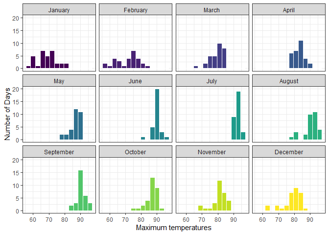
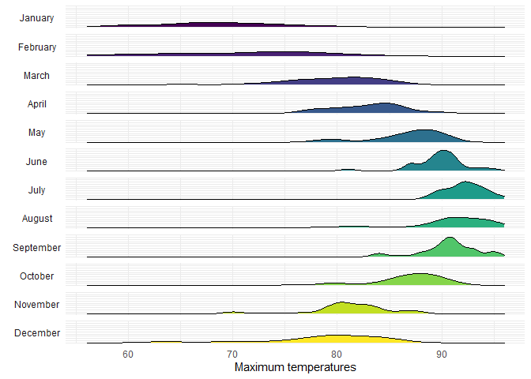
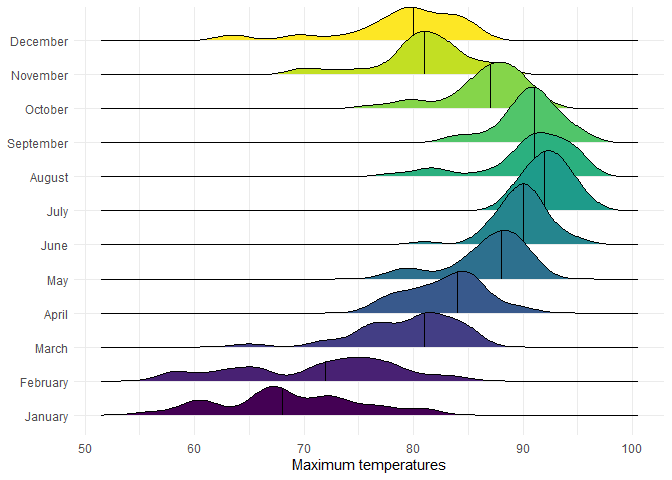

# Data Visualization Project 03


In this exercise you will explore methods to visualize text data and practice how to recreate charts that show the distributions of a continuous variable. 


## Part 1: Density Plots

Using the dataset obtained from FSU's [Florida Climate Center](https://climatecenter.fsu.edu/climate-data-access-tools/downloadable-data), for a station at Tampa International Airport (TPA) from 2016 to 2017, attempt to recreate the charts shown below


```r
library(tidyverse)
weather_tpa <- read_csv("https://github.com/reisanar/datasets/raw/master/tpa_weather_16_17.csv")
# random sample 
sample_n(weather_tpa, 4)
```

```
## # A tibble: 4 × 6
##    year month   day precipitation max_temp min_temp
##   <dbl> <dbl> <dbl>         <dbl>    <dbl>    <dbl>
## 1  2016     7     6             0       94       82
## 2  2016     1     2             0       73       59
## 3  2016     5    19             0       89       76
## 4  2016    12    16             0       79       56
```

See https://www.reisanar.com/slides/relationships-models#10 for a reminder on how to use this dataset with the `lubridate` package for dates and times.


```r
library(lubridate)
```

```
## 
## Attaching package: 'lubridate'
```

```
## The following objects are masked from 'package:base':
## 
##     date, intersect, setdiff, union
```

```r
tpa_clean <- weather_tpa %>% 
  mutate(month = factor(month.name[month], levels = c("January", "February", "March", "April", "May", "June", "July", "August", "September", "October", "November", "December")), 
         max_temp = as.double(max_temp), 
         min_temp = as.double(min_temp), 
         precipitation = as.double(precipitation))
```


(a) Recreate the plot below:


Hint: the option `binwidth = 3` was used with the `geom_histogram()` function.


```r
p1a <- ggplot(tpa_clean, aes(x = max_temp, fill = month))

p1a + geom_histogram(binwidth = 3, color = "white") + theme_bw() + theme(legend.position = "none") + scale_fill_viridis_d() + facet_wrap("month") + labs(x = "Maximum temperatures", y = "Number of Days")
```

<!-- -->


(b) Recreate the plot below:


Hint: check the `kernel` parameter of the `geom_density()` function, and use `bw = 0.5`.


```r
p1b <- ggplot(tpa_clean, aes(x = max_temp))
p1b + geom_density(bw = 0.5, fill = "gray", kernel = "epanechnikov") + theme_minimal() + labs(x = "Maximum temperature") + labs(x = "Maximum temperatures")
```

<!-- -->


(c) Recreate the chart below:


```r
p1c <- ggplot(tpa_clean, aes(x = max_temp, fill = month))

p1c + geom_density(alpha = 0.5) + theme_bw() + theme(legend.position = "none") + scale_fill_viridis_d() + facet_wrap("month") 
```

<!-- -->


Hint: default options for `geom_density()` were used. 

(d) Recreate the chart below:


Hint: default options for `geom_density()` were used. 

I tried my best on this one, but couldn't figure it out exactly

```r
p1d <- ggplot(tpa_clean, aes(x = max_temp, fill = month))

p1d + geom_density() + theme_minimal() + theme(legend.position = "none", strip.text.y.left = element_text(angle = 0)) + scale_fill_viridis_d() + facet_grid("month", switch = "y") + scale_y_continuous(labels = NULL) + labs(x = "Maximum temperatures", y = NULL)
```

<!-- -->


(e) Recreate the plot below:


```r
library(ggridges)

p1e <- ggplot(tpa_clean, aes(x = max_temp, y = month, fill = month))

p1e + geom_density_ridges(quantile_lines = TRUE, quantiles = 2) + theme_minimal() + theme(legend.position = "none") + scale_fill_viridis_d() + labs(x = "Maximum temperatures", y = NULL)
```

```
## Picking joint bandwidth of 1.49
```

<!-- -->


Hint: use the`ggridges` package, and the `geom_density_ridges()` function paying close attention to the `quantile_lines` and `quantiles` parameters.

(f) Recreate the chart below:


Hint: this uses the `plasma` option (color scale) for the _viridis_ palette.


```r
p1a <- ggplot(tpa_clean, aes(x = max_temp, y = month, fill = stat(x)))

p1a + geom_density_ridges_gradient(quantile_lines = TRUE, quantiles = 2) + scale_fill_viridis_c(name = "", option = "C") + theme_minimal() + labs(x = "Maximum temperature (in Fahrenheit degrees)", y = NULL)
```

```
## Picking joint bandwidth of 1.49
```

<!-- -->


## Part 2: Visualizing Text Data

Review the set of slides (and additional resources linked in it) for visualizing text data: https://www.reisanar.com/slides/text-viz#1

Choose any dataset with text data, and create at least one visualization with it. For example, you can create a frequency count of most used bigrams, a sentiment analysis of the text data, a network visualization of terms commonly used together, and/or a visualization of a topic modeling approach to the problem of identifying words/documents associated to different topics in the text data you decide to use. 

Make sure to include a copy of the dataset in the `data/` folder, and reference your sources if different from the ones listed below:

- [Billboard Top 100 Lyrics](https://github.com/reisanar/datasets/blob/master/BB_top100_2015.csv)

- [RateMyProfessors comments](https://github.com/reisanar/datasets/blob/master/rmp_wit_comments.csv)

- [FL Poly News 2020](https://github.com/reisanar/datasets/blob/master/poly_news_FL20.csv)

- [FL Poly News 2019](https://github.com/reisanar/datasets/blob/master/poly_news_FL19.csv)

(to get the "raw" data from any of the links listed above, simply click on the `raw` button of the GitHub page and copy the URL to be able to read it in your computer using the `read_csv()` function)


```r
library(tidytext)
top_100_lyrics <- read_csv("https://raw.githubusercontent.com/reisanar/datasets/master/BB_top100_2015.csv")
```

```
## Rows: 100 Columns: 6
## ── Column specification ────────────────────────────────────────────────────────
## Delimiter: ","
## chr (3): Song, Artist, Lyrics
## dbl (3): Rank, Year, Source
## 
## ℹ Use `spec()` to retrieve the full column specification for this data.
## ℹ Specify the column types or set `show_col_types = FALSE` to quiet this message.
```

```r
top_100_tokens <- top_100_lyrics %>% 
  unnest_tokens(word, Lyrics) %>%
  anti_join(stop_words, by = "word") %>% # remove stopwords
  count(word, sort = TRUE) %>% 
  top_n(20, n) %>% 
  ungroup() %>% 
  mutate(word = fct_inorder(word))
top_100_tokens
```

```
## # A tibble: 20 × 2
##    word      n
##    <fct> <int>
##  1 im      548
##  2 dont    320
##  3 love    308
##  4 baby    173
##  5 wanna   155
##  6 youre   137
##  7 yeah    124
##  8 aint    123
##  9 gonna   117
## 10 hey     112
## 11 time    110
## 12 girl    109
## 13 watch   109
## 14 money   107
## 15 ill     103
## 16 ck       92
## 17 gotta    88
## 18 shake    80
## 19 night    75
## 20 bitch    74
```


```r
ggplot(top_100_tokens, aes(x = n, y = fct_rev(word))) +
  geom_col() + 
  theme(legend.position = "none", plot.title.position = "plot") + 
  labs(x = NULL, y = NULL, title = "The 20 most popular words in the top 100", subtitle = "Billboard top 100, 2015")
```

<!-- -->

